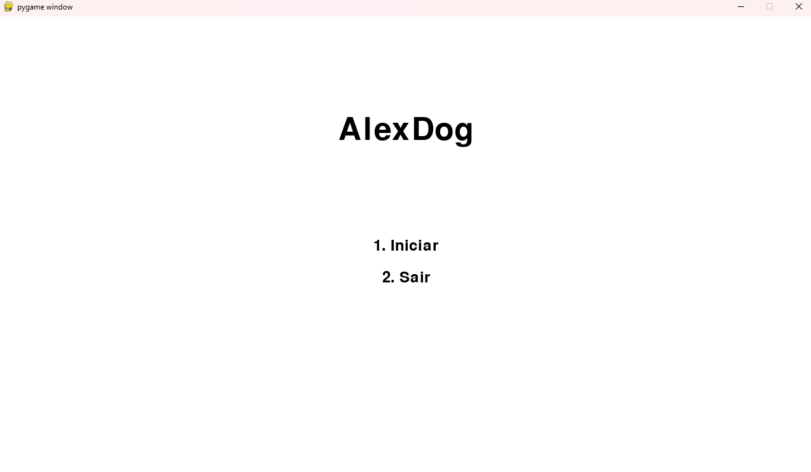
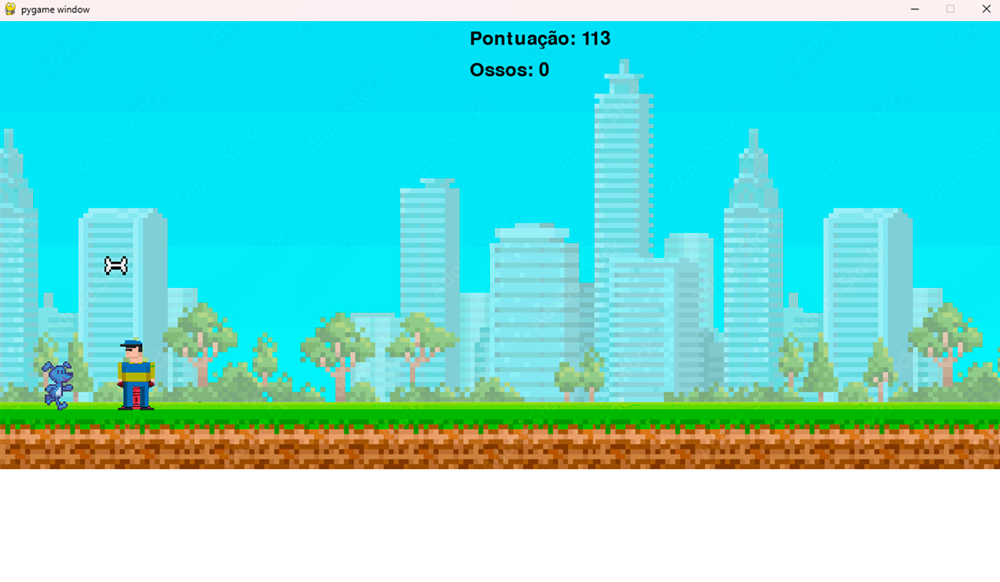

# AlexDog - Jogo de Plataforma em Pygame

## Objetivo do Projeto

O **AlexDog** é um jogo de plataforma desenvolvido com a biblioteca Pygame, inspirada no T-Rex Game, onde o jogador controla um cão em um ambiente de plataforma, desviando de obstáculos (hidrantes e carteiros) e coletando ossos (que podem ser usados como munição para destruir obstáculos). O objetivo é alcançar a maior pontuação possível enquanto coleta ossos e evita colidir com os obstáculos.

## Principais Funcionalidades

- **Movimento do Personagem**: O cão pode saltar para superar obstáculos.
- **Armas**: O jogador pode disparar projéteis, usando os ossos coletados como recurso para a ação de tiro.
- **Obstáculos**: Inclui hidrantes e carteiros que aparecem aleatoriamente e precisam ser evitados.
- **Coleta de Ossos**: Ossos aparecem no cenário e são coletadas para aumentar a pontuação e permitir a compra de munição.
- **Música e Efeitos Sonoros**: Música de fundo e sons de efeito para ações como pular, coletar ossos e disparar projéteis.
- **Tela de Menu e Game Over**: Menus para iniciar o jogo e para quando o jogo termina, mostrando a pontuação e o número de ossos coletadas.

## Tecnologias Utilizadas

- **Python**: Linguagem de programação usada para desenvolver o jogo.
- **Pygame**: Biblioteca utilizada para criar jogos em 2D.
- **Bibliotecas Adicionais**: Não há bibliotecas adicionais além do Pygame.

## Comandos

- **Barra de Espaço**: Pula
- **Shift Esquerdo**: Atira

## Tela inicial do Jogo

## Demonstração do Jogo (clique na tela)
